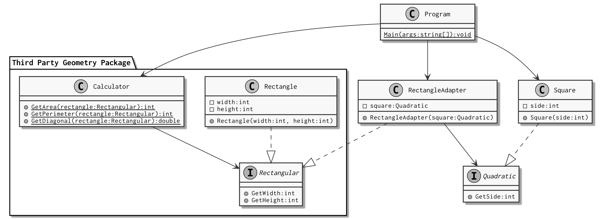

# Aufgaben in Python (`python/`)

Für jede Aufgabe gibt es ein separates Modul mit einem ausführbaren Skript.
Betrachten Sie zunächst jeweils dieses Skript, um den gegebenen Code verstehen
zu können.

Wechseln Sie ins `python`-Unterverzeichnis:

    cd python/

Bearbeiten Sie die folgenden Aufgaben:

## Aufgabe 0: Geometrie (`Geometry`)

Entwurfsmuster: [Adapter](https://refactoring.guru/design-patterns/adapter)
(_structural_)

Hierbei handelt es sich um das Beispiel aus den Folien:

In der Python-Version wurde für die Benennung `snake_case` statt `CamelCase`
verwendet. Sie sollten aber die Strukturen aus dem Klassendiagramm im
Python-Code wiedererkennen können. Anstelle von Interfaces werden sogenannte
_Protocols_ verwendet, die eine ähnliche Funktionsweise haben.

Sie können die Anwendung folgendermassen ausführen:

    python geometry.py

Studieren Sie den Code im Skript `geometry.py` sowie im `geometry/`-Verzeichnis und versuchen Sie diesen zu verstehen.

Erweitern Sie den `Calculator` (`third_party/calculator.py`) um eine weitere
Methode `get_width_height_ratio(Rectangular) -> float`, welche das Verhältnis
von Breite zur Höhe eines Rechtecks berechnet. Testen Sie diese Methode mit
Quadraten; das Verhältnis müsste jeweils `1.0` betragen.

## Aufgabe 1: Lohnbuchhaltung (`payroll`)

Entwurfsmuster: [Adapter](https://refactoring.guru/design-patterns/adapter)
(_structural_)

Beim Beispiel `payroll` handelt es um eine kleine Mitarbeiterverwaltung mit
Lohnbuchhaltung.

Sie können die (fehlerhafte) Anwendung folgendermassen ausführen:

    python payroll.py

Das Modul `payroll.third_party` ist eine Schnittstelle für die Lohnauszahlung. Mithilfe
der Klasse `Banking` und der Methode `PayOut` kann einem `AccountHolder` ein
Geldbetrag überwiesen werden.

Ihre Anwendung verwendet jedoch `Employee`-Objekte, welche das
`Employable`-Protokoll implementieren, aber dummerweise nicht das
`AccountHolder`-Protokoll.

Schreiben Sie einen Adapter, der das `AccountHolder`-Protokoll auf Basis von
einem `Employable` implementiert, sodass den bestehenden `Employee`-Objekten die
Löhne ausbezahlt werden können. (Tipp: Die Kontoverbindung erhalten Sie aus dem
`notes`-Dictionary der `Employee`-Klasse bzw. über die `get_note()`-Methode von
`Employable`.)

## Aufgabe 2: Parkhaussimulation (`parking_lot`)

Entwurfsmuster: [Observer](https://refactoring.guru/design-patterns/observer)
(_behavioral_)

Beim Beispiel `parking_lot` handelt es sich um eine kleine Parkhaussimulation.

Sie können die Anwendung folgendermassen ausführen:

    python parking_lot.py

Ein Parkhaus (`ParkingLot`) hat einen Namen, eine Kapazität (`capacity`) und
einen Füllstand (`occupied`). Mithilfe der Methoden `enter()` und `exit()` kann
ein Auto in das Parkhaus einfahren bzw. dieses verlassen.

Das Skript `parking_lot.py` simuliert das Ein- und Ausfahren von Autos mit
nebenläufigen Threads. Die Funktion `display_state` zeigt dabei in einem eigenen
Thread den Füllstand in regelmässigen Intervallen an.

Bauen Sie die Simulation foldendermassen um:

1. Das Parkhaus soll als _Publisher_ agieren und seine _Subscriber_ jeweils
   informieren, wenn ein Auto in das Parkhaus einfährt oder es verlässt.
    - Erstellen Sie hierzu zwei Protokolle `Publisher` und `Subscriber` mit den
    entsprechenden Methoden.  2. Das `Display` soll als ein _Subscriber_
    agieren, welcher über ein- und
   ausfahrende Autos des Parkhauses informiert wird.
    - Schreiben Sie hierzu eine neue Klasse für das `Display`.
3. Überlegen Sie sich, ob die Ereignisse als eine Reihe von Variablen (Name des
   Parkhauses, Füllstand usw.) übermittelt werden sollen, oder ob hier ein
   spezielles `Event`-Objekt hilfreich wäre.
4. Ein- und ausfahrende Autos einerseits und der Füllstand des Parkhauses
   andererseits sollen nicht mehr in getrennten Meldungen ausgegeben werden,
   sondern zusammen als eine Meldung:

Alt:

    A car entered the lot 'Bahnhof Parking'.
    Bahnhof Parking: 3/100 occupied
    Bahnhof Parking: 3/100 occupied
    Bahnhof Parking: 3/100 occupied
    A car left the lot 'Bahnhof Parking'.
    Bahnhof Parking: 2/100 occupied
    Bahnhof Parking: 2/100 occupied

Neu:

    A car entered the lot 'Bahnhof Parking': 3/100 occupied.
    A car left the lot 'Bahnhof Parking': 2/100 occupied.

Diese kompakte Ausgabe ist nur möglich, wenn auf Polling (d.h. Anfragen in
bestimmten Intervallen) verzichtet wird und man stattdessen einen Mechanismus
wie einen Observer verwendet.

## Aufgabe 3: Ligatabelle (`league_table`)

Entwurfsmuster: [Builder](https://refactoring.guru/design-patterns/builder)
(_creational_)

Beim Beispiel `league_table` geht es um einen Aspekt aus dem bereits bekannten
`soccer-table`-Projekt.

Sie können die Anwendung folgendermassen ausführen:

    python league_table.py

Die Klasse `TableRow` verfügt über einen Konstruktor mit sieben Parametern.
Die Erstellung der Objekte ist darum etwas mühsam; bestehende Deklarationen sind
schwer lesbar.

Erweitern Sie die Klasse `TableRow` um einen _Builder_, wodurch die
Objekterstellung einfacher und besser verständlich werden sollte.

Passen Sie das Skript `league_table.py` so an, dass dieser Gebrauch vom Builder
macht.